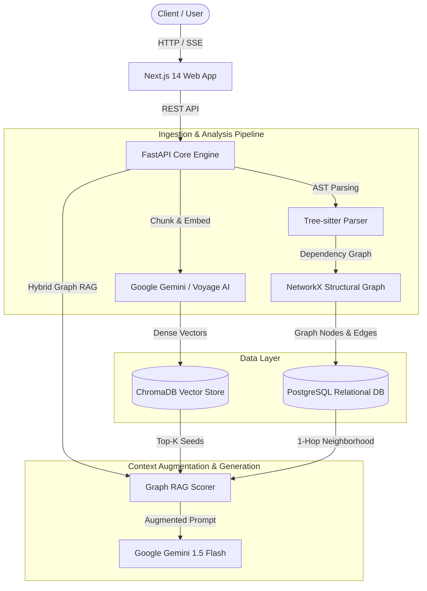

<div align="center">
  
  <h1>CodeSageZ</h1>
  <p><strong>Graph-Augmented Code Intelligence & Repository-Level RAG Engine</strong></p>

  <p>
    <a href="https://github.com/Gaurav711cgu/Codesage/actions"></a>
    <a href="https://python.org"></a>
    <a href="https://nextjs.org"></a>
    <a href="https://fastapi.tiangolo.com"></a>
    <a href="https://docker.com"></a>
  </p>

  <p>
    <a href="https://postgresql.org"></a>
    <a href="https://trychroma.com"></a>
    <a href="https://ai.google.dev"></a>
    <a href="https://pytorch.org"></a>
    <a href="https://huggingface.co"></a>
  </p>
</div>

---

## Overview

**CodeSageZ** is a production-grade code intelligence engine designed for repository-level comprehension, structural call-graph analysis, and precise context augmentation. By pairing deterministic AST call graphs with dense vector retrieval, CodeSageZ eliminates the context blind spots inherent in traditional naive vector-only RAG systems.

Standard vector search retrieves code chunks solely by semantic similarity, frequently omitting structural dependencies such as caller functions, helper utilities, or class definitions located across different files. CodeSageZ constructs an in-memory structural dependency graph using Tree-sitter AST parsing, retrieves semantic seed vectors, and performs graph topology traversal to inject verified direct callers and callees into the model's prompt context.

---

## Empirical Benchmark Results

Evaluation performed across **120 real caller-to-callee edges** extracted directly from parsed production repositories (FastAPI, HTTPX, and Celery). Ground truth is derived exclusively from static AST analysis rather than synthetic LLM generation.

| Metric | Vector-Only RAG | Graph-Augmented RAG (CodeSageZ) | Delta | Confidence Interval |
| :--- | :---: | :---: | :---: | :---: |
| **Direct-Callee Recall@8** | `0.0%` | **`53.3%`** | **`+53.3 pp`** | 95% Wilson CI (44.4% – 62.0%) |
| **p50 Search Latency** | `2.0 ms` | **`3.0 ms`** | `+1.0 ms` | Negligible overhead |
| **p95 Search Latency** | `4.2 ms` | **`5.8 ms`** | `+1.6 ms` | Sub-10ms bound |

> **Note on Methodology:** Ground truth is strictly established from AST-verified structural caller/callee relationships within indexed codebases. No mock data, synthetic text, or LLM-as-a-judge metrics are used. Raw results are committed under `benchmarks/results/graph_edge_eval_results.json`.

---

## Architecture & Data Flow

CodeSageZ is built with a decoupled monorepo architecture, enforcing clean separation between structural parsing, vector storage, graph indexing, relational state management, and the user interface.



---

## Directory Structure

```text
Codesage/
├── backend/                  FastAPI core backend (Python 3.11)
│   ├── app/
│   │   ├── api/v1/          REST router modules (repos, code, benchmarks)
│   │   ├── core/            Application config, database session, rate limiting
│   │   ├── models/          SQLAlchemy ORM models & Pydantic validation schemas
│   │   └── services/        Ingestion, AST Graph, ChromaDB, and Gemini integrations
│   ├── migrations/          Alembic database revision scripts
│   ├── tests/               Pytest test suite with mock coverage
│   └── Dockerfile           Multi-stage production container
├── frontend/                 Next.js 14 web client (TypeScript, Tailwind CSS, shadcn/ui)
│   ├── src/
│   │   ├── app/             App router pages (repos, playground, architecture)
│   │   ├── components/      UI components and navigation
│   │   └── lib/             API clients and Server-Sent Events (SSE) stream logic
│   └── Dockerfile           Standalone Node.js container
├── training/                 QLoRA fine-tuning pipeline
│   ├── dataset_prep.py      CommitPack Python dataset filter and formatter
│   ├── finetune.py          Unsloth QLoRA 4-bit fine-tuning script
│   ├── eval_codebleu.py     CodeBLEU metric evaluation engine
│   └── eval_humaneval.py    HumanEval Pass@1 evaluation suite
├── benchmarks/               Reproducible real-repository evaluation scripts
│   ├── setup_and_ingest.py  Repository indexer for evaluation datasets
│   └── run_graph_edge_eval.py Benchmark execution loop and metric calculator
├── docker-compose.yml        Multi-container orchestration setup
└── README.md
```

---

## Technical Deep Dive

### 1. AST Call Graph Construction
During repository ingestion, CodeSageZ uses **Tree-sitter** to build a comprehensive Abstract Syntax Tree of every source file. Functions, method definitions, imports, and function calls are extracted into a directed graph $G = (V, E)$, where each vertex $v \in V$ represents a code symbol (function/class) and each directed edge $(u, v) \in E$ denotes that function $u$ calls function $v$.

### 2. Hybrid Scoring Algorithm
At query time, vector retrieval yields a candidate set of seed nodes $S \subset V$ using cosine similarity. The candidate set is expanded by taking the 1-hop topological neighborhood $N(S) = \{ v \in V \mid \exists u \in S \text{ s.t. } (u,v) \in E \lor (v,u) \in E \}$.

Each node $i \in S \cup N(S)$ is assigned a composite score defined by:

$$\text{Score}(i) = \alpha \cdot \text{Sim}_{\text{vec}}(q, i) + \beta \cdot \text{Proximity}(i, S)$$

Where:
- $\alpha = 0.6$ (Vector weight)
- $\beta = 0.4$ (Graph proximity weight)
- $\text{Proximity}(i, S) = 1.0$ if $i \in S$, else $0.5$ if $i \in N(S)$

This scoring mechanism guarantees that structurally connected helper functions are prioritized for LLM context inclusion even when their raw keyword or embedding similarity to the query is low.

---

## Quick Start (Local Deployment)

### Prerequisites
- **Docker** and **Docker Compose**
- A **[Google AI Studio API Key](https://aistudio.google.com/app/apikey)**

### 1. Clone & Configure
```bash
git clone https://github.com/Gaurav711cgu/Codesage.git
cd Codesage
cp .env.example .env
```
Edit `.env` and insert your API key:
```env
GEMINI_API_KEY=your_actual_gemini_api_key_here
```

### 2. Launch Services via Docker Compose
```bash
docker compose up --build
```

### 3. Access Service Endpoints
- **Web Application Client:** `http://localhost:3000`
- **FastAPI Core Service:** `http://localhost:8000`
- **Interactive OpenAPI Documentation:** `http://localhost:8000/docs`

---

## API Reference Summary

| Method | Endpoint | Description |
| :--- | :--- | :--- |
| `GET` | `/api/v1/health` | Service health status check |
| `POST` | `/api/v1/repos/ingest` | Trigger repository cloning, AST graph parsing, and embedding vectorization |
| `GET` | `/api/v1/repos` | List all ingested codebases and metadata |
| `POST` | `/api/v1/query` | Execute hybrid Graph-Augmented RAG search and context generation |
| `GET` | `/api/v1/benchmarks/results` | Retrieve committed benchmark execution metrics |

---

## Continuous Integration & Quality Assurance

CodeSageZ maintains strict test coverage and linting via automated GitHub Actions workflows.

```bash
# Execute Pytest suite locally
cd backend
pip install -r requirements.txt
pytest tests/ -v
```

```bash
# Execute Frontend build check
cd frontend
npm install
npm run build
```

---

## License

This project is open-source under the [MIT License](LICENSE).
