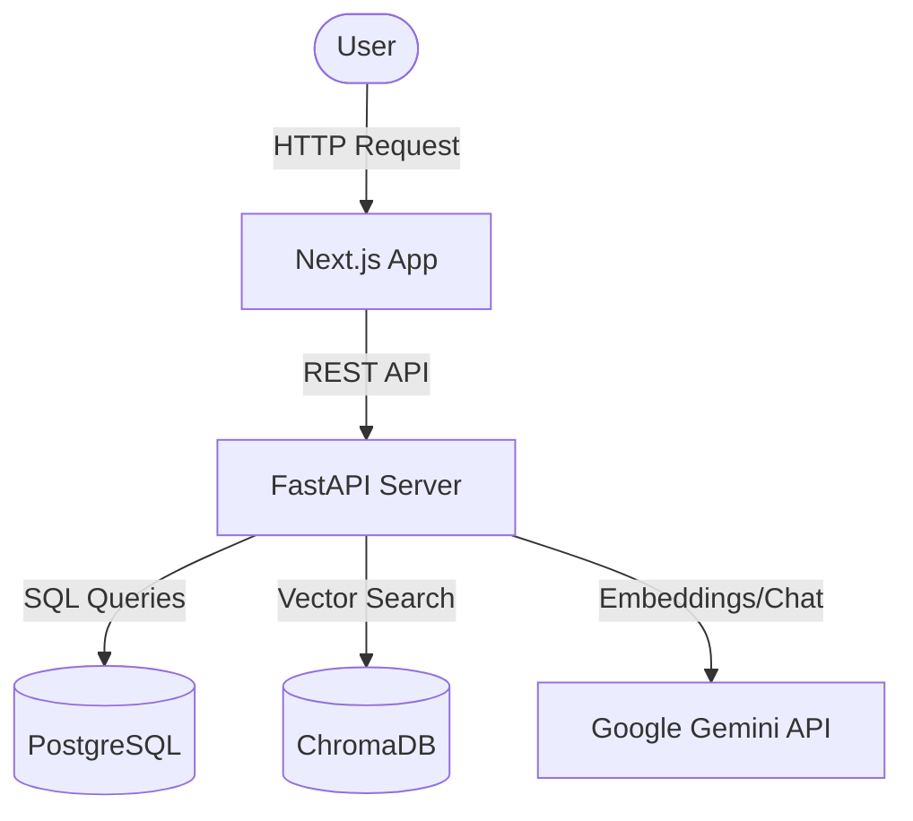

<div align="center">
  <h1>🧠 CodeSageZ v2</h1>
  <p><strong>Graph-augmented retrieval for repository-level code understanding.</strong></p>

  <p>
    <a href="https://github.com/gauravkumarnayak/codesagez/actions"></a>
    <a href="https://python.org"></a>
    <a href="https://nextjs.org"></a>
    <a href="https://fastapi.tiangolo.com"></a>
    <a href="https://www.docker.com/"></a>
  </p>

  <p>
    
    
    
    
    
  </p>
</div>

<br />

CodeSageZ parses a repository into a structural call graph, retrieves relevant symbols using embeddings, and expands context through real caller/callee relationships for unmatched codebase comprehension.

## 📊 Measured Result

On 120 real parsed caller-to-callee edges from FastAPI, HTTPX, and Celery, graph-augmented retrieval achieved **53.3% direct-callee Recall@8** versus **0.0%** for vector-only retrieval (**+53.3 percentage points**, 95% Wilson CI 44.4-62.0%). Graph expansion added just 1 ms at p50 latency (3 ms vs 2 ms).

> **Note:** The benchmark derives ground truth from the indexed repositories' parsed graph; it uses no mock code, synthetic documents, or LLM judge scores. See [`benchmarks/methodology.md`](benchmarks/methodology.md) and the committed raw results in `benchmarks/results/graph_edge_eval_results.json`.

---

## 🚀 Quick Start (Local, under 5 minutes)

### Prerequisites
- **Docker** + **Docker Compose**
- A **[Gemini API key](https://aistudio.google.com/app/apikey)** (free tier)
- *Optional:* A [Supabase](https://supabase.com) project for hosted PostgreSQL.

### 1. Clone and Configure
```bash
git clone https://github.com/gauravkumarnayak/codesagez
cd codesagez
cp .env.example .env
# Fill in GEMINI_API_KEY inside the .env file.
```

### 2. Start the Full Stack (Docker Compose)
We have fully dockerized the application for seamless deployment! Just run:
```bash
docker compose up --build
```
> This spins up PostgreSQL, ChromaDB, the FastAPI backend, and the Next.js frontend automatically.

**Access the services:**
- **Frontend App:** [http://localhost:3000](http://localhost:3000)
- **Backend API:** [http://localhost:8000](http://localhost:8000)
- **API Docs:** [http://localhost:8000/docs](http://localhost:8000/docs)

---

## 🏗️ Architecture & Project Structure

The repository is structured as a modern monorepo, cleanly separating the backend API, frontend client, and ML training pipelines.



<details>
<summary><b>Click to view detailed folder structure</b></summary>

```text
codesagez/
├── backend/          FastAPI backend (Python 3.11)
│   ├── app/
│   │   ├── api/v1/   repo, code, benchmarks endpoints
│   │   ├── core/     config, database
│   │   ├── models/   SQLAlchemy ORM + Pydantic schemas
│   │   └── services/ gemini, ingestion, retrieval, graph, chromadb, ollama
│   ├── migrations/   Alembic
│   ├── tests/        pytest suite
│   └── Dockerfile    Multi-stage container build
├── frontend/         Next.js 14 (TypeScript, Tailwind, shadcn/ui)
│   ├── src/
│   │   ├── app/      playground, repos, benchmarks, architecture pages
│   │   ├── components/
│   │   └── lib/      api.ts, sse.ts
│   └── Dockerfile    Standalone Node container build
├── training/         QLoRA fine-tuning pipeline
│   ├── dataset_prep.py
│   ├── finetune.py
│   ├── eval_codebleu.py
│   └── eval_humaneval.py
├── benchmarks/       Reproducible real-repository evaluation
│   ├── setup_and_ingest.py
│   └── run_graph_edge_eval.py
├── .github/          GitHub Actions CI/CD pipelines
└── docker-compose.yml
```
</details>

---

## 🔬 The Two Technical Contributions

### 1. Graph-augmented RAG
At ingestion time, Tree-sitter parses Python files and builds a NetworkX call graph. At query time, the top-5 vector seeds are expanded by one hop (callers + callees) and re-scored with:

```math
\text{seed score} = 0.6 \times \text{vector\_sim} + 0.4 \times 1.0
```
```math
\text{neighbour score} = 0.6 \times 0.0 + 0.4 \times 0.5
```

The benchmark pipeline compares this with vector-only retrieval on real parsed call-graph edges and stores raw per-edge outputs under `benchmarks/results/`. *Only the committed graph-edge result should be quoted in resumes or interviews.*

### 2. Experimental: QLoRA Bug-fix Fine-tuning
Qwen2.5-Coder-1.5B-Instruct is configured for fine-tuning on 8K CommitPack Python bug-fix commits via **Unsloth QLoRA**. 

The ML workflow records dataset split hashes, model configuration, seed, Git revision, and generation settings in every result file. It refuses to compare baseline and fine-tuned CodeBLEU scores when their held-out test files do not match. See the [model card](training/MODEL_CARD.md) and [GPU runbook](training/GPU_RUNBOOK.md).

> **Note:** The pipeline is included for experimentation, but no fine-tuning result is published in this portfolio until a held-out evaluation has been completed and committed.

---

## ☁️ Production Deployment

CodeSageZ is fully production-ready and dockerized.

**Backend (e.g., Railway / AWS ECS)**
1. Deploy the `backend/` directory using the provided `Dockerfile`.
2. Set `ENVIRONMENT=production`, a persistent `DATABASE_URL` (PostgreSQL), and the deployed `FRONTEND_URL` for CORS.
3. Deploy a persistent ChromaDB service and set `CHROMADB_URL`.
4. The API includes robust **Rate Limiting** via `slowapi` to prevent abuse.

**Frontend (e.g., Vercel / AWS Amplify)**
1. Deploy the `frontend/` directory.
2. Set `NEXT_PUBLIC_API_URL` to your production backend URL.

---

## ✅ Development & CI/CD

We enforce strict CI/CD quality checks using GitHub Actions.

```bash
# Run backend tests locally
cd backend
pip install -r requirements.txt
pytest tests/
```

Every push and PR to the `main` branch automatically triggers our test suite, verifying backend tests pass and frontend builds succeed.

---

## 💡 Interview Q&A

**Q: Why is there no fine-tuning result on the project page?**
A: The fine-tuning pipeline exists, but the evaluation run has not been completed. Publishing blank or unverified numbers would weaken the project. The shipped claim is the reproducible Graph RAG measurement instead.

**Q: Why CodeBLEU not HumanEval as primary metric?**
A: CommitPack trains the model to fix bugs in existing code. HumanEval tests completion from scratch. These are different distributions — evaluating a bug-fix model on HumanEval is a methodology error. CodeBLEU on the held-out CommitPack test set measures whether the model learned the actual training task.

**Q: How is this different from Microsoft's GraphRAG?**
A: GraphRAG constructs a community-level knowledge graph from documents using LLM extraction. This system uses the structural call graph that already exists in source code — no LLM extraction needed. The graph is a fact about the code, not an inference from it.

**Q: Why 1-hop expansion?**
A: One hop is the intentionally narrow structural expansion measured by the direct-callee benchmark. A deeper-hop claim is not made until it has its own reproducible ablation.

---
<div align="center">
  <sub>Built with ❤️ by <a href="https://github.com/gauravkumarnayak">Gaurav Kumar Nayak</a></sub>
</div>
