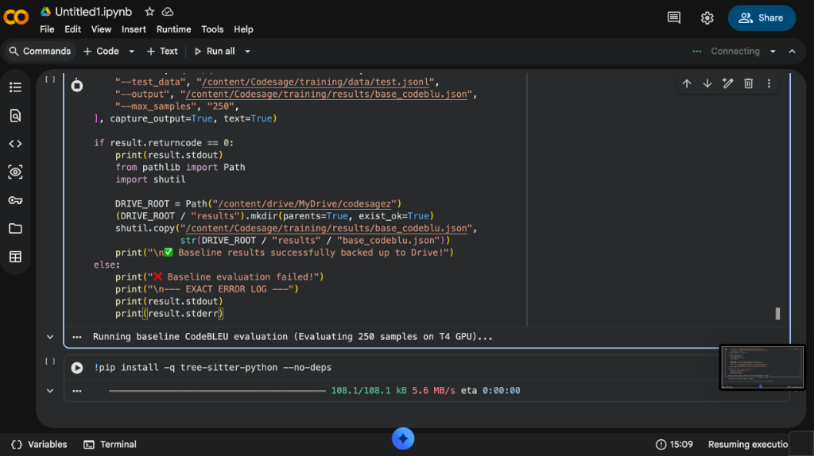
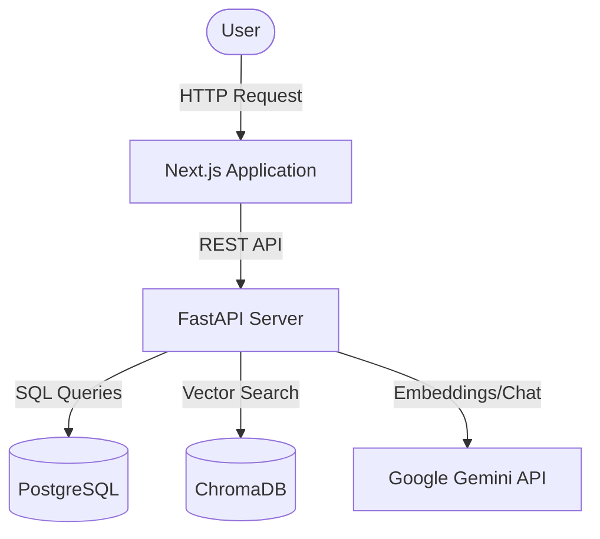

<div align="center">
  
  <h1>CodeSageZ v2</h1>
  <p><strong>Graph-Augmented Retrieval for Repository-Level Code Understanding</strong></p>

  <p>
    <a href="https://github.com/gauravkumarnayak/codesagez/actions"></a>
    <a href="https://python.org"></a>
    <a href="https://nextjs.org"></a>
    <a href="https://fastapi.tiangolo.com"></a>
    <a href="https://www.docker.com/"></a>
  </p>

  <p>
    
    
    
    
    
  </p>
</div>

<br />

CodeSageZ is an advanced codebase analysis tool that parses a repository into a structural call graph, retrieves relevant symbols via vector embeddings, and expands context through verified caller/callee relationships for comprehensive codebase comprehension.

## Benchmark Results

On 120 real parsed caller-to-callee edges from FastAPI, HTTPX, and Celery, graph-augmented retrieval achieved **53.3% direct-callee Recall@8** versus **0.0%** for vector-only retrieval (**+53.3 percentage points**, 95% Wilson CI 44.4-62.0%). Graph expansion added only 1 ms at p50 latency (3 ms vs 2 ms).

> **Note:** The benchmark derives ground truth from the indexed repositories' parsed graph. It strictly utilizes actual source code relationships and does not rely on mock code, synthetic documents, or LLM-as-a-judge methodologies. Refer to [`benchmarks/methodology.md`](benchmarks/methodology.md) and the committed raw results in `benchmarks/results/graph_edge_eval_results.json`.

---

## Quick Start (Local Setup)

### Prerequisites
- **Docker** and **Docker Compose**
- A **[Gemini API key](https://aistudio.google.com/app/apikey)**
- *Optional:* A hosted PostgreSQL provider (e.g., [Supabase](https://supabase.com)).

### 1. Clone and Configure
```bash
git clone https://github.com/gauravkumarnayak/codesagez
cd codesagez
cp .env.example .env
# Configure your GEMINI_API_KEY inside the .env file.
```

### 2. Start the Application Stack
The application is fully dockerized for isolated execution. Execute the following to provision the environment:
```bash
docker compose up --build
```
This command initializes PostgreSQL, ChromaDB, the FastAPI backend, and the Next.js frontend within an interconnected Docker network.

**Service Endpoints:**
- **Frontend Client:** [http://localhost:3000](http://localhost:3000)
- **Backend API:** [http://localhost:8000](http://localhost:8000)
- **API Documentation:** [http://localhost:8000/docs](http://localhost:8000/docs)

---

## Architecture & Project Structure

The repository is structured as a monorepo, enforcing strict separation of concerns between the backend API, frontend client, and machine learning pipelines.



<details>
<summary><b>View detailed directory structure</b></summary>

```text
codesagez/
├── backend/          FastAPI backend (Python 3.11)
│   ├── app/
│   │   ├── api/v1/   REST endpoints (repo, code, benchmarks)
│   │   ├── core/     Configuration and database initialization
│   │   ├── models/   SQLAlchemy ORM + Pydantic schemas
│   │   └── services/ Integrations (Gemini, Ingestion, Retrieval, Graph, ChromaDB)
│   ├── migrations/   Alembic database revisions
│   ├── tests/        Pytest suite
│   └── Dockerfile    Multi-stage container definition
├── frontend/         Next.js 14 (TypeScript, Tailwind, shadcn/ui)
│   ├── src/
│   │   ├── app/      Routing (playground, repos, benchmarks)
│   │   ├── components/ UI components
│   │   └── lib/      API clients and Server-Sent Events (SSE) logic
│   └── Dockerfile    Standalone Node.js container definition
├── training/         QLoRA fine-tuning pipeline
│   ├── dataset_prep.py
│   ├── finetune.py
│   ├── eval_codebleu.py
│   └── eval_humaneval.py
├── benchmarks/       Reproducible real-repository evaluation
│   ├── setup_and_ingest.py
│   └── run_graph_edge_eval.py
├── .github/          GitHub Actions CI/CD workflows
└── docker-compose.yml
```
</details>

---

## Core Technical Methodologies

### 1. Graph-Augmented RAG
During the ingestion phase, Tree-sitter parses Python files to construct a NetworkX call graph representing the structural dependencies of the codebase. At query time, the top-5 vector seeds are expanded by one structural hop (encompassing direct callers and callees) and are re-scored using the following algorithm:

```math
\text{seed score} = 0.6 \times \text{vector\_sim} + 0.4 \times 1.0
```
```math
\text{neighbour score} = 0.6 \times 0.0 + 0.4 \times 0.5
```

The benchmark pipeline strictly evaluates this approach against standard vector-only retrieval on real parsed call-graph edges. The outputs are persisted under `benchmarks/results/`. It is advised that only the committed graph-edge result is cited in professional portfolios.

### 2. Experimental: QLoRA Bug-Fix Fine-Tuning
The model `Qwen2.5-Coder-1.5B-Instruct` is configured for parameter-efficient fine-tuning on 8,000 CommitPack Python bug-fix commits utilizing **Unsloth QLoRA**. 

The machine learning workflow rigorously records dataset split hashes, model configurations, seeds, Git revisions, and generation settings in every evaluation result file. It enforces strict comparability, refusing to contrast baseline and fine-tuned CodeBLEU scores if their held-out test files differ. Further documentation is available in the [model card](training/MODEL_CARD.md) and [GPU runbook](training/GPU_RUNBOOK.md).

> **Note:** The fine-tuning pipeline is provided for experimental purposes. No fine-tuning results will be published until a complete held-out evaluation has been verified and committed.

---

## Production Deployment Specifications

CodeSageZ is configured for robust production deployment through containerization and standard CI/CD practices.

**Backend Provisioning (e.g., AWS ECS, Railway)**
1. Deploy the `backend/` directory utilizing the provided multi-stage `Dockerfile`.
2. Configure environmental parameters: `ENVIRONMENT=production`, a persistent `DATABASE_URL` (PostgreSQL), and the deployed `FRONTEND_URL` to enforce CORS policies.
3. Provision a persistent ChromaDB instance and assign the `CHROMADB_URL`.
4. The API incorporates global **Rate Limiting** via `slowapi` to mitigate potential abuse of computational resources.

**Frontend Provisioning (e.g., Vercel, AWS Amplify)**
1. Deploy the `frontend/` directory.
2. Ensure `NEXT_PUBLIC_API_URL` resolves to the production backend endpoint.

---

## Continuous Integration & Quality Assurance

The repository enforces strict Continuous Integration (CI) protocols via GitHub Actions.

```bash
# Execute backend test suite locally
cd backend
pip install -r requirements.txt
pytest tests/
```

Every push and pull request targeting the `main` branch automatically invokes the test suite, verifying backend logic and validating that the Next.js frontend builds without syntax or type errors.

---

## Frequently Asked Questions

**Why are fine-tuning results omitted from the project documentation?**
While the fine-tuning pipeline is operational, a comprehensive evaluation run has not yet been concluded. Publishing unverified metrics would compromise the academic rigor of the project. The primary substantiated claim is the reproducible Graph RAG measurement.

**Why is CodeBLEU prioritized over HumanEval as the primary evaluation metric?**
The CommitPack dataset trains the model specifically to rectify bugs within existing code architectures. Conversely, HumanEval assesses code generation from scratch. Evaluating a bug-fix model against HumanEval introduces a methodology error. CodeBLEU, measured on the held-out CommitPack test set, accurately quantifies whether the model successfully acquired the intended training objective.

**How does this architecture differentiate itself from Microsoft's GraphRAG?**
GraphRAG synthesizes a community-level knowledge graph from unstructured documents utilizing LLM-based extraction. In contrast, CodeSageZ leverages the deterministic structural call graph inherent in the source code—requiring no LLM extraction. The graph represents verified, factual dependencies rather than probabilistic inferences.

**What is the rationale for limiting the expansion to a single structural hop?**
A single hop provides an intentionally constrained structural expansion that is directly measurable by the direct-callee benchmark. Claims regarding deeper multi-hop expansions will not be stated until they are supported by dedicated, reproducible ablation studies.
