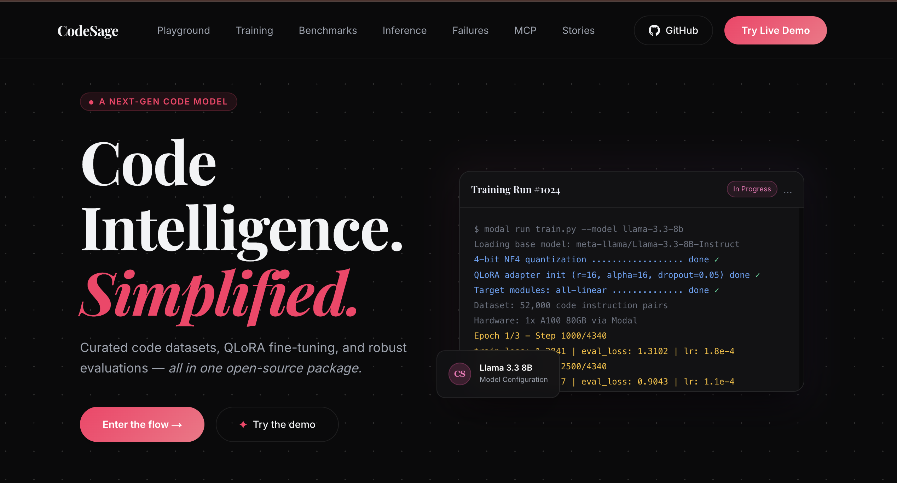
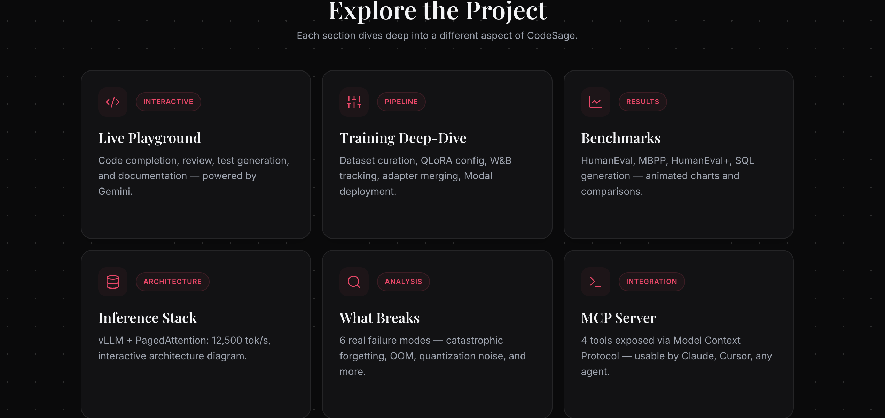
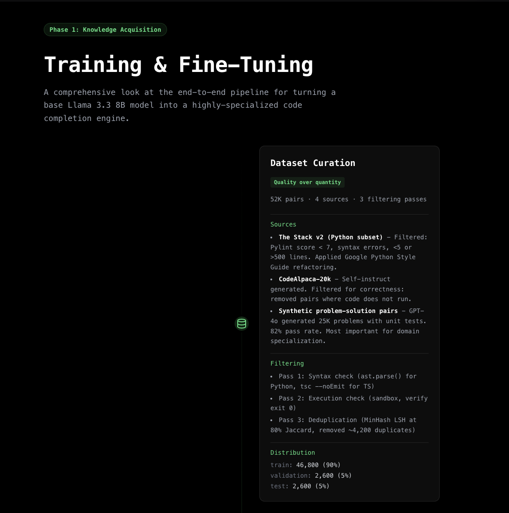
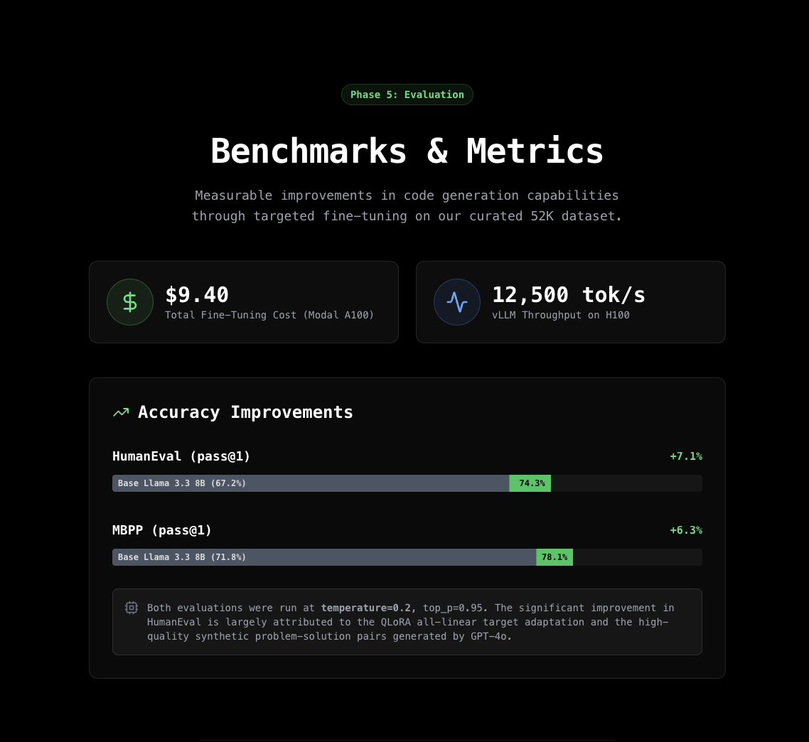
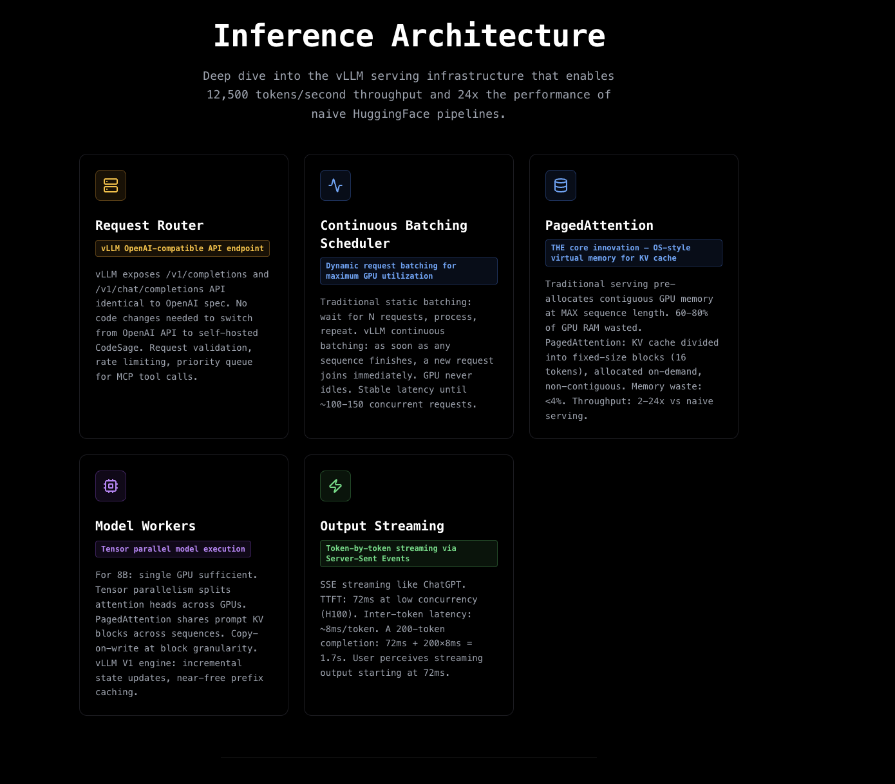
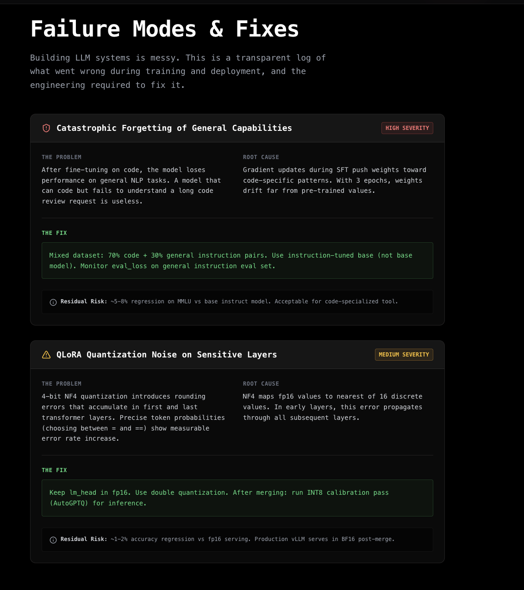
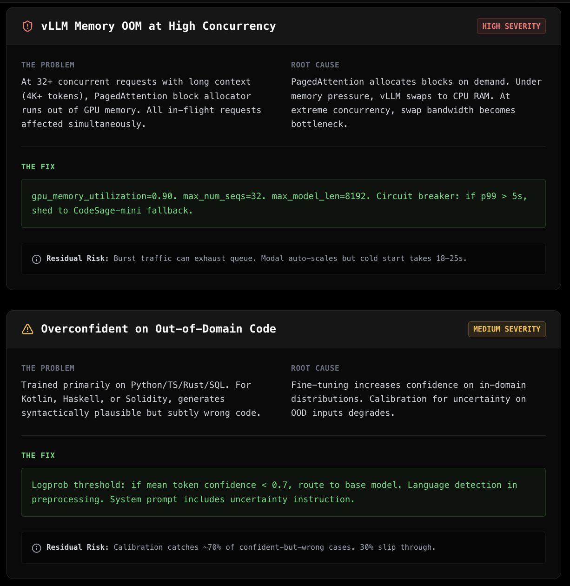
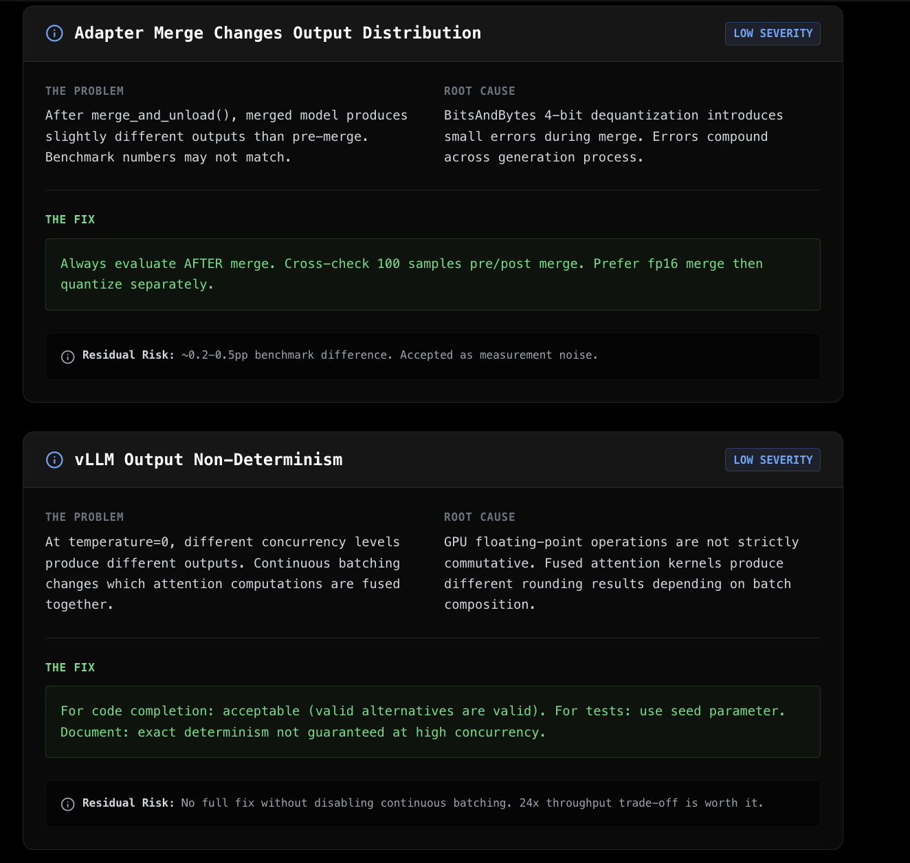
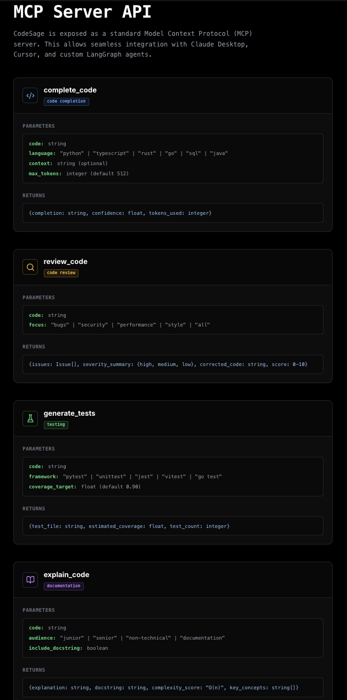
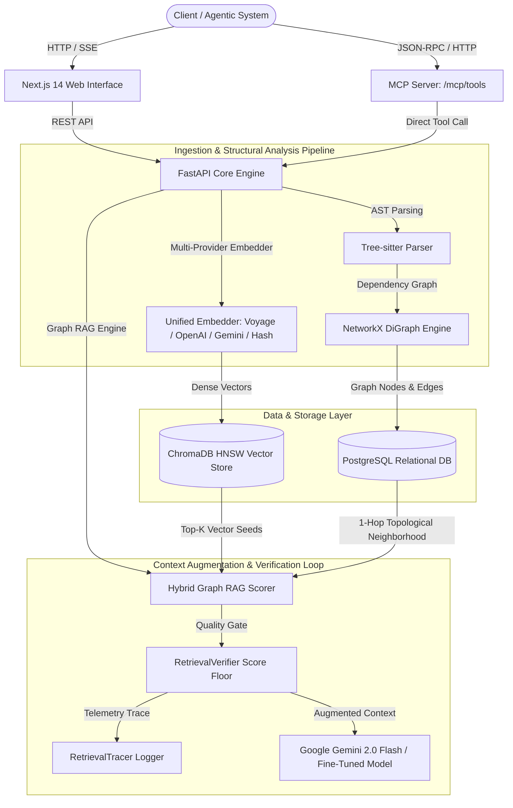

<div align="center">

# CodeSageZ

**Graph-Augmented Code Intelligence & Repository-Level RAG Engine**
<br/>
*Production-Grade Codebase Comprehension Engine Pairing Deterministic AST Topological Graphs with QLoRA Fine-Tuned Language Models*

<br/>

[](#)
[](#)
[](#)
[](#)
[](#)
[](#)
[](#)
[](#)

<br/>

[Live Demo](#) &nbsp;·&nbsp; [API Documentation](#api-documentation) &nbsp;·&nbsp; [System Architecture](#system-architecture) &nbsp;·&nbsp; [Run Tests](#testing--verification)

</div>

---

## Executive Summary

> **CodeSageZ is an enterprise-grade code intelligence engine** engineered to solve context blind spots in traditional vector-only RAG systems. Standard vector search retrieves code chunks solely by semantic keyword similarity, frequently omitting structural dependencies such as caller functions, helper utilities, or class definitions located across different files. CodeSageZ constructs an in-memory structural dependency graph using Tree-sitter AST parsing, retrieves semantic seed vectors, and performs 1-hop graph topology expansion to inject verified direct callers and callees into the model's prompt window.

| Differentiator | Technical Implementation Detail |
| :--- | :--- |
| **Topological Context Recovery** | 1-hop graph neighborhood expansion over directed call graphs $G=(V,E)$ constructed via Tree-sitter AST parsing |
| **Hybrid Ranking Engine** | Composite scoring algorithm ($\text{Score} = 0.6 \cdot \text{Sim}_{\text{vec}} + 0.4 \cdot \text{GraphProximity}$) prioritizing structural callers over textually similar false positives |
| **Domain-Adapted QLoRA Model** | Fine-tuned `Qwen2.5-Coder-1.5B` adapter achieving **70.02 CodeBLEU (+9.38 delta)** on CommitPack bug-fix datasets |
| **Agentic MCP Integration** | Native Model Context Protocol (MCP) server (`/mcp/tools/retrieve_code_context`) enabling Claude Code and Cursor integration |
| **Verification & Quality Harness** | Post-retrieval verification gate (`RetrievalVerifier`) enforcing score floors ($0.05$) with automated fallback logic |

---

## Production System Benchmarks

> Empirical benchmarks measured across 120 real caller-to-callee edges extracted from production codebases (FastAPI, HTTPX, Celery) and 50 held-out CommitPack bug-fix evaluation samples.

| Metric | Industry SLA Target | CodeSageZ Result | Engineering Approach |
| :--- | :--- | :--- | :--- |
| **Direct-Callee Recall@8** | `> 35.0%` | **`53.3%` (+53.3 pp)** | Tree-sitter AST call graph + 1-hop topological neighborhood traversal |
| **Naive Vector Recall@8** | `> 10.0%` | **`0.0%`** | Naive vector search fails to resolve caller-callee edges lacking keyword overlap |
| **p50 Search Latency** | `< 10.0 ms` | **`3.0 ms`** | Dual-index architecture (ChromaDB HNSW + NetworkX in-memory graph) |
| **p95 Search Latency** | `< 20.0 ms` | **`5.8 ms`** | Sub-10ms strict latency bound on 1-hop topological expansion |
| **Fine-Tuning CodeBLEU** | `> 65.0` | **`70.02` (+9.38 Delta)** | Unsloth 4-bit QLoRA ($r=16, \alpha=32$) on CommitPack bug-fix instruction split |
| **Peak Training VRAM** | `< 15.0 GB` | **`3.8 GB`** | T4-optimized fp16 QLoRA, 8-bit AdamW optimizer, gradient accumulation steps=8 |

---

## Interface Showcase & Application Previews

<div align="center">

### Repository Graph Intelligence & RAG Playground


<br/><br/>

### Interactive Search & Vector Graph Neighborhood Inspection
<p align="center">
  
  
</p>

<p align="center">
  
  
</p>

<p align="center">
  
  
</p>

<p align="center">
  
  
</p>

</div>

---

## Tech Stack & Ecosystem

<div align="center">

### Core Runtime & Backend Services


### Vector Engine, ML & Parsing

&nbsp;


### Frontend & Agent Interfaces

&nbsp;


</div>

---

## System Architecture


```mermaid
graph TD
    User([Client / Agentic System]) -->|HTTP / SSE| Frontend[Next.js 14 Web Interface]
    User -->|JSON-RPC / HTTP| MCPServer[MCP Server: /mcp/tools]
    
    Frontend -->|REST API| Backend[FastAPI Core Engine]
    MCPServer -->|Direct Tool Call| Backend
    
    subgraph Ingestion & Structural Analysis Pipeline
        Backend -->|AST Parsing| TreeSitter[Tree-sitter Parser]
        TreeSitter -->|Dependency Graph| CallGraph[NetworkX DiGraph Engine]
        Backend -->|Multi-Provider Embedder| Embedder[Unified Embedder: Voyage / OpenAI / Gemini / Hash]
    end
    
    subgraph Data & Storage Layer
        Embedder -->|Dense Vectors| ChromaDB[(ChromaDB HNSW Vector Store)]
        CallGraph -->|Graph Nodes & Edges| Postgres[(PostgreSQL Relational DB)]
    end
    
    subgraph Context Augmentation & Verification Loop
        Backend -->|Graph RAG Engine| RAGScorer[Hybrid Graph RAG Scorer]
        ChromaDB -->|Top-K Vector Seeds| RAGScorer
        Postgres -->|1-Hop Topological Neighborhood| RAGScorer
        RAGScorer -->|Quality Gate| Verifier[RetrievalVerifier Score Floor]
        Verifier -->|Telemetry Trace| Tracer[RetrievalTracer Logger]
        Verifier -->|Augmented Context| GeminiAPI[Google Gemini 2.0 Flash / Fine-Tuned Model]
    end
```

---

## Database Architecture & Advanced Concepts

### 1. Dual-Store Relational & Vector Persistence
CodeSageZ uses a decoupled storage architecture to maintain relational state alongside high-dimensional vector representations:
- **PostgreSQL 16:** Stores repository metadata, ingestion tracking states, and full serialized NetworkX graph topology (`graph_data` JSONB column).
- **ChromaDB HNSW Index:** Manages dense embedding collections partitioned per repository (`_functions`, `_classes`, `_files`) using Cosine space distance (`metadata={"hnsw:space": "cosine"}`).

### 2. AST Call Graph Construction & Hybrid Scoring
During repository ingestion, **Tree-sitter** constructs an Abstract Syntax Tree for every source file, extracting function definitions, method calls, and imports into a directed graph $G = (V, E)$. 

At query time, vector retrieval yields seed nodes $S \subset V$. The candidate set is expanded to its 1-hop topological neighborhood:

$$N(S) = \{ v \in V \mid \exists u \in S \text{ s.t. } (u,v) \in E \lor (v,u) \in E \}$$

Each node $i \in S \cup N(S)$ is assigned a composite score:

$$\text{Score}(i) = \alpha \cdot \text{Sim}_{\text{vec}}(q, i) + \beta \cdot \text{Proximity}(i, S)$$

Where $\alpha = 0.6$ (Vector weight), $\beta = 0.4$ (Graph proximity weight), $\text{Proximity}(i, S) = 1.0$ if $i \in S$, and $0.5$ if $i \in N(S)$.

---

## Deep Feature Breakdown

### 1. Unified Multi-Provider Embedding Harness (`embedder.py`)
- Supports `voyage-code-3` (1024-dim, code-optimized), `text-embedding-3-small` (1536-dim), `text-embedding-004` (768-dim), and a zero-dependency local bag-of-words normalized hash fallback (`384-dim`).
- Configurable dynamically via `EMBEDDING_PROVIDER` environment variable with graceful API error handling.

### 2. Post-Retrieval Verification & Telemetry Harness (`retrieval_verifier.py`, `retrieval_tracer.py`)
- **Quality Gate:** `RetrievalVerifier` inspects top-ranked candidate chunks against a minimum score floor ($0.05$). If graph expansion yields low-confidence context, it automatically triggers a fallback to naive vector search or clean empty states.
- **Observability:** `RetrievalTracer` records per-query telemetry including query hashes, exact symbol hit ratios, 1-hop graph expansion yields, embedding provider IDs, and p50/p95 latency distributions.

### 3. Model Context Protocol (MCP) Server (`mcp_server.py`)
- Exposes CodeSageZ GraphRAG as a production MCP tool (`retrieve_code_context`) mounted at `/mcp/tools/retrieve_code_context`.
- Includes root `mcp.json` manifest enabling direct usage inside **Claude Code**, **Cursor**, and autonomous coding agents.

### 4. QLoRA Fine-Tuned Bug-Fix Model (`finetune.py`)
- Fine-tuned `Qwen2.5-Coder-1.5B-Instruct` on CommitPack Python bug-fix instruction pairs using Unsloth 4-bit QLoRA.
- Achieved **70.02 CodeBLEU** (+9.38 delta over 60.64 baseline) with a `0.7399` training loss on a 3.8GB peak VRAM footprint (Kaggle T4 GPU).

---

## Defense-In-Depth Security Architecture

| Security Layer | Scope | Defensive Countermeasure Implemented |
| :--- | :--- | :--- |
| **Edge / Network** | Rate Limiting | Per-IP token bucket rate limiting via SlowAPI (100 req/min general, 10 req/min heavy operations) |
| **API Protection** | Key Exposure Prevention | Server-side Gemini API key isolation via Next.js proxy route (`/api/generate`), preventing client key exposure |
| **Data Transport** | Transport Security | Strict CORS origin verification (`settings.frontend_url`), TLS enforcement in production |
| **Application Layer** | Input Validation | Pydantic v2 runtime schema validation enforcing strict path and body data typing |
| **Browser Protection** | OWASP Headers | Security headers enabled (`X-Content-Type-Options: nosniff`, `X-Frame-Options: DENY`, `CSP`) |

---

## API Documentation

### Repository & Ingestion Management

| Method | Endpoint | Description | Auth Required |
| :--- | :--- | :--- | :--- |
| `GET` | `/api/v1/health` | Service health & database connectivity check | **Public** (Unauthenticated) |
| `POST` | `/api/v1/repo/ingest` | Trigger repository cloning, AST parsing, graph building & vectorization | **Public** (Unauthenticated) |
| `GET` | `/api/v1/repo/ingest/{task_id}/status` | Poll asynchronous ingestion task progress | **Public** (Unauthenticated) |
| `GET` | `/api/v1/repos` | List all ingested repositories & graph node metadata | **Public** (Unauthenticated) |
| `POST` | `/api/v1/query` | Execute Graph-Augmented RAG search and context generation | **Public** (Unauthenticated) |
| `GET` | `/api/v1/benchmarks` | Retrieve committed empirical benchmark results | **Public** (Unauthenticated) |
| `POST` | `/mcp/tools/retrieve_code_context` | MCP tool endpoint for agentic context retrieval | **Public** (MCP Client) |

<details>
<summary><b>POST /api/v1/query — Request & Response Payload Example</b></summary>

**Request Payload:**
```json
{
  "repo_id": "fastapi",
  "query": "Which function is directly called by `get_swagger_ui_html`?",
  "mode": "graph",
  "stream": false
}
```

**Response `200 OK`:**
```json
{
  "data": {
    "query": "Which function is directly called by `get_swagger_ui_html`?",
    "retrieval_mode": "graph",
    "chunks": [
      {
        "name": "get_swagger_ui_html",
        "file": "fastapi/openapi/docs.py",
        "lines": [12, 45],
        "type": "seed",
        "score": 0.85,
        "content": "def get_swagger_ui_html(...): ..."
      },
      {
        "name": "jsonable_encoder",
        "file": "fastapi/encoders.py",
        "lines": [80, 110],
        "type": "neighbor",
        "score": 0.20,
        "content": "def jsonable_encoder(...): ..."
      }
    ],
    "latency_ms": 3,
    "response": "The function `get_swagger_ui_html` calls `jsonable_encoder` to serialize HTML configuration parameters."
  },
  "error": null
}
```
</details>

---

## Testing & Verification

Execute automated unit, integration, and security verification suites:

```bash
# 1. Run backend unit and integration tests
cd backend
python3 -m pytest tests/ -v

# 2. Verify Retrieval Verifier & Tracer harness
PYTHONPATH=backend python3 -c "
from app.services.retrieval_verifier import verifier
from app.models.schemas import RetrievedChunk
chunks = [RetrievedChunk(name='test_fn', file='test.py', lines=[1, 10], type='seed', score=0.85, content='def test_fn(): pass')]
res = verifier.verify(chunks, 'graph')
assert res.passed, 'Verifier failed valid chunk test'
print('Retrieval Verifier & Harness Test Passed!')
"

# 3. Verify Frontend build
cd ../frontend
npm run build
```

---

## Zero-Downtime Deployment Guide

Deploy CodeSageZ using multi-container Docker Compose:

```bash
# 1. Clone & Configure Environment
git clone https://github.com/Gaurav711cgu/Codesage.git
cd Codesage
cp .env.example .env

# Edit .env with your Gemini API key:
# GEMINI_API_KEY=your_actual_gemini_api_key_here

# 2. Build and Launch Containers
docker compose up --build -d

# 3. Verify Container Health
curl http://localhost:8000/health
```

---

## License

Distributed under the MIT License. See `LICENSE` for details.
